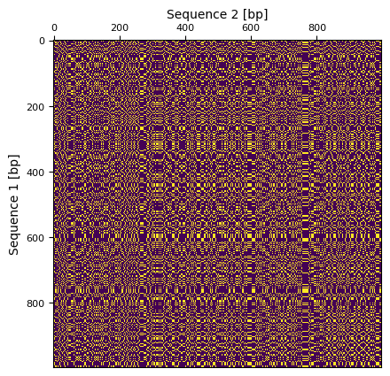
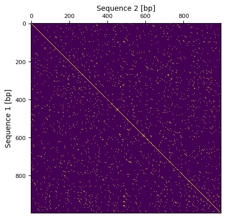

# Domácí úkol č. 8

> **Upravujte pouze soubor `assignment_8_1.py`.**

### Numpy
`NumPy` (*Numerical Python*) je open source balíček jazyka Python, který se používá téměř ve všech oblastech vědy a 
techniky. V Pythonu nám nahrazuje velkou část základních funkcionalit jazyku Matlab, který je velmi oblíbený pro 
zpracování dat (s velmi podobnou syntaxí).
V průběhu studia se setkáte s jejím opakovaným využitím, například pro zpracování signálů či zpracování obrazů. 
Velmi vhodné je využití knihovny `numpy` v případě, kdy chcete danou operaci provést pro všechny hodnoty v poli 
(*array*) hodnot.

### Matplotlib 
`Matplotlib` je balíček pro vykreslování v programovacím jazyce Python, která velmi dobře spolupracuje právě s knihovnou
`numpy`. Tato knihovna nám zastává vykreslovací funkcionality jazyka Matlab (s velmi podobnou syntaxí). Využíváme ji 
opět při zobrazování zpracovávaných dat.

> Balíčky `numpy` a `matplotlib` je potřeba nainstalovat příkazem `python -m pip install numpy matplotlib` 
> nebo v PyCharmu přes *File -> Settings -> Project -> Project -> Python interpreter -> **+** a vyhledání a 
> nainstalování patřičné knihovny*.

## Vizualizace podobností dvou sekvencí

Vaším úkolem bude provést analýzu [nukleotidové sekvence](https://en.wikipedia.org/wiki/Nucleic_acid_sequence) vybraných genů člověka a vizualizovat jejich podobnost. 
Podobnost genů bude reprezentována pomocí bodové matice. V nejjednodušším případě jsou pomocí znaku `*` označeny pozice
(body), kde se sekvence shodují. Pokud by byly sekvence naprosto shodné, byla by v matici vidět mimo jiné diagonála
vedoucí z levého horního do pravého dolního rohu.
U podobných ale ne shodných sekvencích může matice vypadat třeba takto:

|       | G | G | T | C | A |
|-------|:-:|:-:|:-:|:-:|:-:|
| **G** | * | * |   |   |   |
| **T** |   |   | * |   |   |
| **C** |   |   |   | * |   |
| **A** |   |   |   |   | * |
| **G** | * | * |   |   |   |
| **A** |   |   |   |   | * |
| **T** |   |   | * |   |   |

Pro porovnání kratších sekvencí je tento přístup dostačující, ale v případě delších sekvencí by při takto jednoduchých
pravidlech docházelo k vykreslování velkého množství bodů, které by ztížili interpretaci výsledků. Obvykle se totiž
snažíme zjistit, jak moc a v jakých úsecích jsou si sekvence podobné tzn. snažíme se v matici najít diagonální úseky. 

Pro filtraci šumu se obvykle využívá výpočet v plovoucím okně, kdy se neporovnávají sekvence znak po znaku,
ale porovnávají jejich dílčí části. Následně je na základě počtu shod mezi částmi rozhodnuto, zda bude do matice doplněn
bod nebo ne.

|   Bez filtrace    | S filtrací (velikost okna 7, minimální počet shod v okně 5) |
|:-----------------:|:-----------------------------------------------------------:|
|   |                                             |

### Načtení dat
Nukleotidové sekvence jsou uložené v adresáři `input_data` v souborech `sequence01.txt` a `sequence02.txt`. 
* Vašim prvním úkolem bude vytvořit funkci `load_sequence()` pro načtení dat z textového souboru.
* Funkce bude mít jeden vstupní parametr typu `str`, který bude reprezentovat cestu k souboru.
* Výstupem funkce bude textový řetězec se kompletní nukleotidovou sekvencí.
* Funkce bude mít za úkol z textového souboru získat pouze nukleotidovou sekvenci (znaky `A`, `C`, `G`, `T`) a  
  vytvořit jeden dlouhý textový řetězec.

### Počet shod dvou sekvencí
* Vytvořte funkci `count_matches()`, která spočítá, na kolika pozicích se nachází shodné znaky v obou sekvencích.
* Funkce bude mít 2 vstupní parametry:
  * první nukleotidovou sekvenci typu `str`,
  * druhou nukleotidovou sekvenci typu `str`.
* Funkce vrátí počet shodných pozic mezi dvěmi sekvencemi typu `int`.
  * Např. pro sekvence `"ACCGT"` a `"AGCGC"` vrátí hodnotu `3`:
  
  |   A    |   C   |   C    |   G    |   T   |
  |:------:|:-----:|:------:|:------:|:-----:|
  | **\|** |       | **\|** | **\|** |       |
  | **A**  | **G** | **C**  | **G**  | **C** |

### Bodová matice
* Vytvořte funkci `compute_matrix()`, která vytvoří bodovou matici na základě výpočtu podobnosti sekvencí v plovoucích
  oknech a definovaném minimálním počtu shod.
* Funkce bude mít čtyři vstupní parametry:
  * první nukleotidovou sekvenci typu `str`,
  * druhou nukleotidovou sekvenci typu `str`,
  * velikost okna pro výpočet podobnosti typu `int`,
  * minimální počet shod v okně typu `int`.
* Funkce bude vracet bodovou matici typu `np.array`.
* V prvním kroku bude potřeba vytvořit matici, která bude mít tolik řádků, kolik má znaků první sekvence (obecně `n`), 
  a tolik sloupců, kolik má znaků druhá sekvence (obecně `m`). Pomocí knihovny `numpy` vytvořte matici samých nul 
  o velikosti `n` x `m`.
* Pro porovnání sekvencí bude potřeba procházet sekvence pomocí dvou plovoucích oken. První okno bude procházet první
  sekvenci a druhé okno druhou sekvenci. Pro výpočet celé matice bude nutné porovnat všechny pozice oken navzájem.
  Tedy:
  1. Umísti první okno na začátek první sekvence = vyber podsekvenci z první sekvence, která začíná na indexu `0` a 
     délkou odpovídá velikosti okna.
  2. Umísti druhé okno na začátek druhé sekvence = vyber podsekvenci z druhé sekvence, která začíná na indexu `0` a 
     délkou odpovídá velikosti okna.
  3. Zjisti počet shod mezi plovoucími okny/sekvencemi (využij funkci z předchozího úkolu).
  4. Pokud je počet shod větší než minimální požadovaný počet shod, zapiš do matice na pozici začátku prvního plovoucího
     a pozici začátku druhého plovoucího okna hodnotu `1`. (Hodnota `1` bude představovat jeden bod v matici resp. 
     nalezenou podobnost mezi sekvencemi).
  5. Vrať se k bodu č. 2 a zvyš hodnotu indexu o jedna. 
  6. Opakuj body č. 2 až 5, dokud plovoucím oknem neprojdeš celou druhou sekvenci.
  7. Pak zvyš hodnotu indexu prvního plovoucího okna o jedna a opakuj body č. 2 až 7, pokud neprojdeš celou první 
     sekvenci.

### Vykreslení bodové matice
Pro vykreslování bodové matice můžete použít předpřipravenou funkci `plot_matrix()`. Její popis je dostupný v 
dokumentačním řetězci funkce.

### Hlavní funkce
 * Vytvořte hlavní funkci programu `main()`.
 * Funkce bude mít čtyři vstupní parametry:
   * cesta k souboru s první sekvencí typu `str`,
   * cesta k souboru s druhou sekvenci typue `str`,
   * velikost okna pro výpočet podobnosti typu `int`,
   * minimální počet shod v okně typu `int`.
 * Funkce vrátí vypočítanou bodovou matici.
 * Funkce provede:
   * načtení dvou sekvencí,
   * výpočet bodové matice,
   * vykreslení bodové matice.
