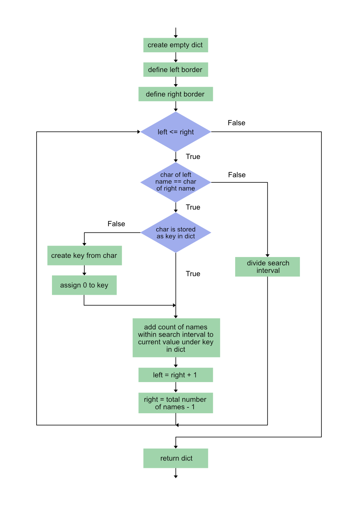

[](https://classroom.github.com/a/rU1-FUe6)
# Domácí úkol č. 9

> **Upravujte pouze soubor `assignment_9_1.py`.**


## Četnost studentů
Mějme abecedně setříděný seznam jmen (např. studentů ve třídě), ve kterém se mohou opakovat jména se stejným počátečním
znakem, např.:

```python
classroom = ["Ctibor", "Cyril", "Ines", "Lily", "Lada", "Otta", "Quido", "Teodor", "Tibor", "Tereza"]
```

Vašim úkolem je zjistit **četnost studentů se stejným počátečním znakem**.

> Naivním algoritmem by bylo sekvenční prohlédávání seznamu. Takový algoritmus bude mít asymptotickou složitost O(n). 
> My však víme, že na seřazeném seznamu umíme pracovat efektivněji, např. pomocí binárního vyhledávání. 
> Hlavním cílem tohoto úkolu je modifikace algoritmu binárního vyhledávání pro určení četnosti jmen se stejným 
> počátečním znakem.


### Načtení dat
Ve složce `files` je umístěn soubor `czech_names.txt`, ve kterém je uložen výběr českých jmen. Seznamte se s možnostmi 
načtení `*.txt` souborů do Pythonu. Dále zjistěte, jak je možné pomocí balíčku `os` zjistit cestu do pracovního adresáře
(current working directory) s naším úkolem, a jak je možné pomocí metody `os.path` spojit několik řetězců do jedné cesty
– požadovaný výsledek je cesta k našemu souboru, např. pro uživatele Windows:

```
C:\BPC-PRG\lecture_09\hw_09\files\czech_names.txt
```

* V modulu `assignment_9_1.py` proveďte import balíčku `os`.
* V modulu vytvořte funkci `read_file()`. 
* Funkce bude mít jeden vstupní parametr, který bude reprezentovat název souboru včetně jeho přípony, 
  např.: `"czech_names.txt"`.
* Funkce vytvoří pomocí vhodných metod balíčku `os` absolutní cestu k našemu souboru (viz ukázka výše).
* Funkce načte všechna jména ze souboru a vrátí je ve formě seznamu.
* Ve funkci `main()` implementujte volání funkce `read_data()` pro soubor `czech_names.txt` a výstup uložte do vhodné 
  proměnné.

> Pozor na vyhrazené znaky pro zalomení řádku, ty je nutné z každého řetězce (jména) odstranit.


###	Vytvoření slovníku
V tomto úkolu vytvoříte ze seznamu jmen abecední slovník.

* V modulu `assignment_9_1.py` vytvořte funkci `names_to_dict()`. 
* Funkce bude mít jeden vstupní parametr typu `list`.
* Funkce vrátí slovník jmen roztříděných podle počátečního písmene. Klíče budou tvořeny **velkými** počátečními znaky
  jmen. Hodnotou každého klíče bude seznam všech jmen, která začínají stejným znakem, např.:
    ```python
    sorted_names = {"A": ["Alena", "Alois"], "B": ["Bivoj", "Boleslav", "Blanka"]}
    ```

  
###	Generátor
V modulu `generator.py` je ve funkci `generate_classroom()` připraven náhodný generátor jmenného seznamu třídy.
Vstupem do generátoru je **slovník** s kategorizovanými jmény. Výstupem je náhodný seznam jmen setříděný dle abecedy. 

* Do modulu `assignment_9_1.py` proveďte import generátoru z modulu `generator.py`.
* V hlavní funkci vygenerujte pomocí generátoru jmenný seznam reprezentující univerzitní třídu a uložte jej do proměnné
  `classroom`.
  
### Binární vyhledávání na seřazené sekvenci (metoda půlení intervalu)
Už jste asi pochopili, že předchozí kroky slouží – kromě opakování užitečných věcí :) – hlavně k přípravě sekvence,
se kterou budete nyní pracovat. Pokud jste postupovali správně, získali jste seznam podobný tomu, který jsme uvedli v 
úvodu.

* V modulu `assignment_9_1.py` vytvořte funkci `frequency_counter()` s jedním vstupním parametrem. 
* Do hlavní funkce doplňte volání funkce `frequency_counter()`. Vstupním argumentem bude proměnná `classroom`.
* Do funkce `frequency_counter()` doplňte algoritmus založený na binárním vyhledávání, který spočítá četnost jmen
  se stejným počátečním znakem. Výstup funkce bude slovník v následující vzorové formě: 
  ```python
  counts = {"A": 5, "C": 2, "D": 8, "P": 3, "Z": 1}
  ```

> Aby bylo možné algoritmus vyhledávání založený na půlení intervalu správně modifikovat, je potřeba začít důkladnou
> analýzou řešeného problému. Při vyhledávání konkrétního čísla je Vašim cílem nalézt pouze jeden prvek z množiny 
> seřazených prvků. V tomto příkladu však vyhledáváte **celý interval** možných řešení. Tento interval odpovídá po sobě
> jdoucím jménům se stejným počátečním znakem. Pokud tedy právě analyzovaný interval obsahuje na začátku i konci jméno
> se stejným počátečním znakem, můžete provést součet jmen v tomto intervalu a výsledek uložit. Při půlení intervalu 
> však může nastat situace, kdy jedna z hranic rozdělí sekvenci jmen se stejným znakem na dvě části. Uložený součet tedy
> musíte pokládat pouze za dočasný. Současně je nutné po provedení každého součtu nastavit nové hranice oblasti tak, 
> aby prohlédání prostoru bylo úplné. V tomto se algoritmus významně liší oproti vyhledávání číslice, kde druhou 
> z oblastí po rozpůlení intervalu již neanalyzujete. Pokuste se řešení algoritmu navrhnout samostatně. Pokud byste si
> přesto nevěli rady, přikládáme vývojový diagram možného řešení.



